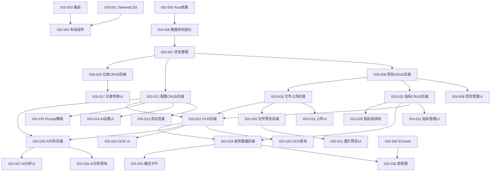

# 健康管理系统 — 敏捷开发 Todo List

> 采用 Epic → Feature → Story → Issue 层级划分，标注依赖关系与优先级

---

## Epic 1：基础设施搭建（Infrastructure）

### Feature 1.1：项目工程初始化

#### Story 1.1.1：前端框架配置
- [ ] **ISS-001** 安装 TailwindCSS 并配置 `tailwind.config.js`
  - 验收：`npm run dev` 启动无报错，TailwindCSS 样式生效
  - 测试：创建测试页面验证 `class="text-red-500"` 生效
- [ ] **ISS-002** 安装 ECharts 及 `vue-echarts` 组件
  - 验收：在测试页面渲染一个简单折线图，依赖 ISS-001
- [ ] **ISS-003** 配置 Vue Router 三模块路由结构
  - 路由：`/upload`（上传存档）、`/settings`（系统设置）、`/trends`（趋势分析）
  - 页面参考：上传存档->stich/index.html, 系统设置->stich/setting.html, 趋势分析->stich/analysis.html
  - 验收：侧边栏导航点击可切换三个空白页面
- [ ] **ISS-004** 创建全局中文化布局组件（侧边栏 + 顶栏 + 内容区）
  - 使用 Element Plus 的 `el-container`/`el-menu` 布局
  - 验收：应用启动后可看到中文侧边栏菜单与布局框架
  - 依赖：ISS-003

#### Story 1.1.2：后端基础设施
- [ ] **ISS-005** 在 `Cargo.toml` 中添加依赖：`rusqlite`、`serde`、`serde_json`、`uuid`、`reqwest`（含 socks5-proxy feature）、`tokio`、`chrono`
  - 验收：`cargo build` 编译通过
- [ ] **ISS-006** 创建 SQLite 数据库初始化模块，程序启动时自动建表（8 张表）
  - 文件：`src-tauri/src/db.rs`
  - 验收：启动后在程序目录生成 `health_guard.db`，表结构正确
  - 测试用例：单元测试——调用初始化后用 SQL 查询所有表名，断言 8 张表存在
  - 依赖：ISS-005
- [ ] **ISS-007** 创建 Tauri 状态管理：将 DB 连接池注入 `AppState`
  - 验收：任意 Tauri Command 可访问数据库连接
  - 依赖：ISS-006

---

## Epic 2：系统设置模块（Settings）

> **优先级最高**，其他模块依赖此模块的配置数据

### Feature 2.1：检查项目管理

#### Story 2.1.1：项目 CRUD
- [ ] **ISS-008** [后端] 实现 `list_projects`、`create_project`、`update_project`、`delete_project` 四个 Tauri Command
  - 创建项目时自动在 `pictures/{项目名称}/` 创建文件夹
  - 删除时检查是否有关联的 `checkup_files`，有则拒绝
  - 测试用例：创建项目 → 查列表含该项目 → 更新名称 → 再查验证 → 删除 → 列表为空
  - 依赖：ISS-007
- [ ] **ISS-009** [前端] 项目管理页面 UI
  - 使用 `el-table` 展示项目列表，含名称、描述、状态、操作列
  - 新增/编辑使用 `el-dialog` 表单
  - 启用/停用使用 `el-switch` 切换
  - 验收：可完成项目的增删改查全流程
  - 依赖：ISS-008

#### Story 2.1.2：检查指标管理
- [ ] **ISS-010** [后端] 实现 `list_indicators`、`create_indicator`、`update_indicator`、`delete_indicator`
  - 支持设置指标名称、单位、参考范围、是否核心指标
  - 测试用例：在项目下创建指标 → 查询 → 标记核心 → 删除
  - 依赖：ISS-008
- [ ] **ISS-011** [前端] 指标管理 UI（嵌入项目管理页面）
  - 点击项目行展开指标列表，或使用 `el-drawer` 管理指标
  - 验收：可在项目下完成指标的增删改查
  - 依赖：ISS-009, ISS-010

### Feature 2.2：AI 接口配置

#### Story 2.2.1：AI 配置管理
- [ ] **ISS-012** [后端] 实现 `get_config`、`save_config` 通用配置 Command
  - 配置键：`ai_api_url`、`ai_api_key`、`ai_models`、`proxy_enabled`、`proxy_url`、`proxy_username`、`proxy_password`
  - 测试用例：保存配置 → 读取验证一致
  - 依赖：ISS-007
- [ ] **ISS-013** [后端] 实现 `test_ai_connection` Command
  - 使用当前配置发送简单请求验证连通性，支持 SOCKS5 代理
  - 测试用例：配置有效 URL → 测试返回成功；配置无效 URL → 返回失败信息
  - 依赖：ISS-012
- [ ] **ISS-014** [前端] AI 设置页面 UI
  - 表单字段：URL、Key（密码输入）、模型列表（动态添加/删除 tag）、代理设置（条件显隐）
  - "测试连接"按钮，成功/失败弹出 `el-message`
  - 验收：配置保存后刷新页面数据不丢失；测试连接功能正常
  - 依赖：ISS-012, ISS-013

#### Story 2.2.2：OCR / AI Prompt 模板配置
- [ ] **ISS-015** [后端+前端] OCR Prompt 模板与 AI 分析 Prompt 模板设置
  - 使用 `el-input` type="textarea" 编辑 Prompt 模板
  - 提供默认模板（程序首次启动时写入）
  - 配置键：`ocr_prompt_template`、`ai_analysis_prompt_template`
  - 验收：可编辑并保存自定义 Prompt
  - 依赖：ISS-012

---

## Epic 3：检查数据上传与存档模块（Upload & Archive）

> 依赖 Epic 2 的项目管理和配置

### Feature 3.1：检查记录管理

#### Story 3.1.1：检查记录 CRUD
- [ ] **ISS-016** [后端] 实现 `create_checkup_record`、`list_checkup_records`、`get_checkup_record`、`delete_checkup_record`
  - 列表支持分页与日期范围筛选
  - 删除时级联删除关联文件（磁盘+数据库）、OCR 结果、AI 分析、指标值
  - 测试用例：创建 → 列表查询 → 详情查询 → 删除 → 验证级联清除
  - 依赖：ISS-007
- [ ] **ISS-017** [前端] 检查记录列表页面
  - `el-table` 展示：日期、项目数、文件数、状态 tag（待OCR/已OCR/已分析）
  - 日期范围筛选器 `el-date-picker`
  - "新建检查记录"按钮 → 弹窗选择日期
  - 验收：可看到记录列表，可新建和删除
  - 依赖：ISS-016

### Feature 3.2：文件上传

#### Story 3.2.1：多项目批量上传
- [ ] **ISS-018** [后端] 实现 `upload_checkup_files` Command
  - 接收 `record_id` + 按项目分组的文件路径列表
  - 将文件复制到 `pictures/{项目名}/{日期}/{文件名}` 目录
  - 写入 `checkup_files` 表
  - 测试用例：上传 3 个项目共 5 个文件 → 验证文件存在 + 数据库记录正确
  - 依赖：ISS-008, ISS-016
- [ ] **ISS-019** [前端] 检查记录详情页 — 文件上传区域
  - 按检查项目分 Tab 或分区展示，每个项目一个 `el-upload` 组件
  - 支持多文件、拖拽上传
  - 底部"一键上传"按钮
  - 已上传文件以缩略图网格展示，支持预览和删除
  - 验收：选择多个项目的文件 → 一键上传 → 检查 pictures 目录结构正确
  - 依赖：ISS-018

#### Story 3.2.2：文件预览与管理
- [ ] **ISS-020** [后端] 实现 `get_file_preview`（返回 base64 缩略图）和 `delete_checkup_file`
  - 删除时同步删除磁盘文件
  - 依赖：ISS-018
- [ ] **ISS-021** [前端] 图片预览大图弹窗（`el-image-viewer`）
  - 验收：点击缩略图可查看原图
  - 依赖：ISS-020

### Feature 3.3：OCR 识别

#### Story 3.3.1：OCR 请求与结果处理
- [ ] **ISS-022** [后端] 实现 `start_ocr` Command
  - 读取记录下所有文件，按项目分组
  - 将图片 base64 编码 + OCR Prompt 发送给 AI 视觉模型
  - 解析返回 JSON，写入 `ocr_results` 表
  - 同时提取指标值写入 `indicator_values` 表
  - 更新记录状态为 `ocr_done`
  - 通过 Tauri Event 发送完成通知到前端
  - 测试用例：模拟 AI 返回 → 验证 `ocr_results` 和 `indicator_values` 写入正确
  - 依赖：ISS-012, ISS-018, ISS-010
- [ ] **ISS-023** [后端] 实现 `get_ocr_status`、`get_ocr_results`
  - 依赖：ISS-022
- [ ] **ISS-024** [前端] OCR 操作与结果展示
  - 记录详情页添加"OCR 识别"按钮，点击后显示进度
  - 监听 Tauri Event 接收完成通知，使用 `ElNotification` 提示
  - OCR 结果以表格形式展示（指标名、值、单位、参考范围、是否异常）
  - 验收：点击 OCR → 等待通知 → 查看结构化结果
  - 依赖：ISS-022, ISS-023

### Feature 3.4：AI 分析

#### Story 3.4.1：AI 分析请求与展示
- [ ] **ISS-025** [后端] 实现 `start_ai_analysis` Command
  - 聚合当次全部 OCR 数据 + 历史检查数据，构建 Prompt
  - 调用 AI Chat 接口（流式返回），通过 Tauri Event 逐步推送内容
  - 完整结果保存到 `ai_analyses` 表
  - 更新记录状态为 `analyzed`
  - 测试用例：模拟 AI 流式返回 → 验证事件推送 + 数据库保存
  - 依赖：ISS-012, ISS-022
- [ ] **ISS-026** [后端] 实现 `get_ai_analysis`
  - 依赖：ISS-025
- [ ] **ISS-027** [前端] AI 分析操作与结果展示
  - "AI 分析"按钮（OCR 完成后才可用）
  - 流式显示 AI 回复，使用 Markdown 渲染器展示
  - 历史分析结果可回顾
  - 验收：发起分析 → 实时看到 AI 回复 → 完成后可再次查看
  - 依赖：ISS-025, ISS-026

---

## Epic 4：趋势分析模块（Trend Analysis）

> 依赖 Epic 2（指标定义）和 Epic 3（指标值数据）

### Feature 4.1：趋势图

#### Story 4.1.1：指标选择与图表渲染
- [ ] **ISS-028** [后端] 实现 `get_indicator_trend`（按指标ID查询历史值）和 `get_latest_comparison`
  - 返回：`[{ date, value, is_abnormal }]` 数组
  - 测试用例：插入 5 条不同日期的指标值 → 查询 → 验证返回按日期排序
  - 依赖：ISS-010, ISS-022
- [ ] **ISS-029** [前端] 左侧指标选择树
  - 使用 `el-tree` 组件，按项目分组展示指标
  - 支持复选框勾选，默认勾选核心指标
  - 验收：页面加载后展示项目-指标树，可勾选
  - 依赖：ISS-010
- [ ] **ISS-030** [前端] 右侧 ECharts 趋势图渲染
  - 每个选中指标生成独立图表
  - 折线图（默认）/ 柱状图切换
  - 参考范围阴影区域、异常值红色标注、hover 显示详细数值
  - 日期范围筛选
  - 验收：选择指标后显示趋势图，数据点正确
  - 依赖：ISS-028, ISS-029, ISS-002

#### Story 4.1.2：数据概览卡片
- [ ] **ISS-031** [前端] 最新检查概要 + 前次对比
  - 在图表上方用 `el-card` 展示最新一次检查的核心指标
  - 与前次对比显示 ↑↓ 趋势，异常指标红色
  - 验收：有至少两次数据时可看到对比趋势
  - 依赖：ISS-028

---

## Epic 5：通知与体验优化

### Feature 5.1：应用内通知
- [ ] **ISS-032** 全局通知中心
  - 前端监听 Tauri Event，使用 `ElNotification` 弹出通知
  - 通知类型：OCR 完成、AI 分析完成、操作失败
  - 依赖：ISS-022, ISS-025

### Feature 5.2：错误处理
- [ ] **ISS-033** 统一错误处理与中文提示
  - 后端 Rust 定义统一错误类型和中文错误消息
  - 前端统一拦截错误并展示
  - 依赖：ISS-007

---

## 依赖关系图



---

## 开发迭代计划

### Sprint 1（第1-2周）：基础设施 + 系统设置
| 优先级 | Issue | 说明 |
|--------|-------|------|
| P0 | ISS-001 ~ ISS-007 | 前后端基础搭建 |
| P0 | ISS-008 ~ ISS-011 | 检查项目与指标管理 |
| P0 | ISS-012 ~ ISS-015 | AI 配置与 Prompt 模板 |
| P1 | ISS-033 | 统一错误处理 |

### Sprint 2（第3-4周）：上传与 OCR
| 优先级 | Issue | 说明 |
|--------|-------|------|
| P0 | ISS-016 ~ ISS-017 | 检查记录管理 |
| P0 | ISS-018 ~ ISS-021 | 文件上传与预览 |
| P0 | ISS-022 ~ ISS-024 | OCR 识别 |
| P1 | ISS-032 | 应用内通知 |

### Sprint 3（第5-6周）：AI 分析 + 趋势
| 优先级 | Issue | 说明 |
|--------|-------|------|
| P0 | ISS-025 ~ ISS-027 | AI 分析 |
| P0 | ISS-028 ~ ISS-031 | 趋势分析 |

---

## DDD 测试用例概要

### 领域层单元测试（Rust）

```rust
// 测试文件: src-tauri/src/tests/

// TC-001: 检查项目聚合根
#[test] fn create_project_generates_uuid_and_folder() {}
#[test] fn delete_project_with_files_should_fail() {}
#[test] fn deactivate_project_hides_from_upload() {}

// TC-002: 检查指标值对象
#[test] fn indicator_value_detects_abnormal_by_reference_range() {}
#[test] fn core_indicator_flag_filters_correctly() {}

// TC-003: 检查记录聚合根
#[test] fn record_status_transitions_pending_to_ocr_done() {}
#[test] fn record_status_transitions_ocr_done_to_analyzed() {}
#[test] fn delete_record_cascades_all_children() {}

// TC-004: OCR 结果解析
#[test] fn parse_ocr_json_extracts_indicator_values() {}
#[test] fn ocr_failure_sets_error_status() {}

// TC-005: AI 分析
#[test] fn build_analysis_prompt_includes_historical_data() {}
#[test] fn ai_response_saves_to_database() {}

// TC-006: 趋势数据查询
#[test] fn trend_query_returns_chronological_order() {}
#[test] fn trend_query_filters_by_date_range() {}
#[test] fn latest_comparison_returns_two_most_recent() {}

// TC-007: 配置管理
#[test] fn save_and_load_config_roundtrip() {}
#[test] fn proxy_config_applies_to_http_client() {}
```

### 集成测试

```rust
// TC-INT-001: 完整上传→OCR→分析流程
#[test] fn full_workflow_upload_ocr_analyze() {}

// TC-INT-002: 文件存储路径验证
#[test] fn uploaded_file_stored_in_correct_directory_structure() {}
```

### 前端 E2E 测试场景

| 编号 | 场景 | 步骤 |
|------|------|------|
| E2E-001 | 项目管理 | 新建项目"血常规" → 添加指标"白细胞" → 标记核心 → 禁用 → 启用 |
| E2E-002 | 文件上传 | 新建记录 → 选择"血常规"上传 2 张图 → 选择"肝功能"上传 1 张图 → 一键上传 → 验证缩略图 |
| E2E-003 | OCR 流程 | 上传后点击"OCR识别" → 等待通知 → 查看结构化结果表格 |
| E2E-004 | AI 分析 | OCR 完成后点击"AI分析" → 观察流式输出 → 查看 Markdown 渲染结果 |
| E2E-005 | 趋势图 | 勾选"白细胞"指标 → 查看折线图 → 切换柱状图 → 筛选日期范围 |
