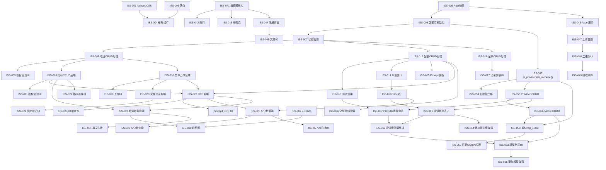

# 健康管理系统 — 敏捷开发 Todo List

> 采用 Epic → Feature → Story → Issue 层级划分，标注依赖关系与优先级

---

## Epic 1：基础设施搭建（Infrastructure）

### Feature 1.1：项目工程初始化

#### Story 1.1.1：前端框架配置
- [ ] **ISS-001** 安装 TailwindCSS 并配置 `tailwind.config.js`
  - 验收：`npm run dev` 启动无报错，TailwindCSS 样式生效
  - 测试：创建测试页面验证 `class="text-red-500"` 生效
- [ ] **ISS-002** 安装 ECharts 及 `vue-echarts` 组件
  - 验收：在测试页面渲染一个简单折线图，依赖 ISS-001
- [ ] **ISS-003** 配置 Vue Router 三模块路由结构
  - 路由：`/upload`（上传存档）、`/settings`（系统设置）、`/trends`（趋势分析）
  - 页面参考：上传存档->stich/index.html, 系统设置->stich/setting.html, 趋势分析->stich/analysis.html
  - 验收：侧边栏导航点击可切换三个空白页面
- [ ] **ISS-004** 创建全局中文化布局组件（侧边栏 + 顶栏 + 内容区）
  - 使用 Element Plus 的 `el-container`/`el-menu` 布局
  - 验收：应用启动后可看到中文侧边栏菜单与布局框架
  - 依赖：ISS-003

#### Story 1.1.2：后端基础设施
- [ ] **ISS-005** 在 `Cargo.toml` 中添加依赖：`rusqlite`、`serde`、`serde_json`、`uuid`、`reqwest`（含 socks5-proxy feature）、`tokio`、`chrono`
  - 验收：`cargo build` 编译通过
- [ ] **ISS-006** 创建 SQLite 数据库初始化模块，程序启动时自动建表（8 张表）
  - 文件：`src-tauri/src/db.rs`
  - 验收：启动后在程序目录生成 `health_guard.db`，表结构正确
  - 测试用例：单元测试——调用初始化后用 SQL 查询所有表名，断言 8 张表存在
  - 依赖：ISS-005
- [ ] **ISS-007** 创建 Tauri 状态管理：将 DB 连接池注入 `AppState`
  - 验收：任意 Tauri Command 可访问数据库连接
  - 依赖：ISS-006

---

## Epic 2：系统设置模块（Settings）

> **优先级最高**，其他模块依赖此模块的配置数据

### Feature 2.1：检查项目管理

#### Story 2.1.1：项目 CRUD
- [ ] **ISS-008** [后端] 实现 `list_projects`、`create_project`、`update_project`、`delete_project` 四个 Tauri Command
  - 创建项目时自动在 `pictures/{项目名称}/` 创建文件夹
  - 删除时检查是否有关联的 `checkup_files`，有则拒绝
  - 测试用例：创建项目 → 查列表含该项目 → 更新名称 → 再查验证 → 删除 → 列表为空
  - 依赖：ISS-007
- [ ] **ISS-009** [前端] 项目管理页面 UI
  - 使用 `el-table` 展示项目列表，含名称、描述、状态、操作列
  - 新增/编辑使用 `el-dialog` 表单
  - 启用/停用使用 `el-switch` 切换
  - 验收：可完成项目的增删改查全流程
  - 依赖：ISS-008

#### Story 2.1.2：检查指标管理
- [ ] **ISS-010** [后端] 实现 `list_indicators`、`create_indicator`、`update_indicator`、`delete_indicator`
  - 支持设置指标名称、单位、参考范围、是否核心指标
  - 测试用例：在项目下创建指标 → 查询 → 标记核心 → 删除
  - 依赖：ISS-008
- [ ] **ISS-011** [前端] 指标管理 UI（嵌入项目管理页面）
  - 点击项目行展开指标列表，或使用 `el-drawer` 管理指标
  - 验收：可在项目下完成指标的增删改查
  - 依赖：ISS-009, ISS-010

### Feature 2.2：AI 接口配置

#### Story 2.2.1：AI 配置管理
- [ ] **ISS-012** [后端] 实现 `get_config`、`save_config` 通用配置 Command
  - 配置键：`ai_api_url`、`ai_api_key`、`ai_models`、`proxy_enabled`、`proxy_url`、`proxy_username`、`proxy_password`
  - 测试用例：保存配置 → 读取验证一致
  - 依赖：ISS-007
- [ ] **ISS-013** [后端] 实现 `test_ai_connection` Command
  - 使用当前配置发送简单请求验证连通性，支持 SOCKS5 代理
  - 测试用例：配置有效 URL → 测试返回成功；配置无效 URL → 返回失败信息
  - 依赖：ISS-012
- [ ] **ISS-014** [前端] AI 设置页面 UI
  - 表单字段：URL、Key（密码输入）、模型列表（动态添加/删除 tag）、代理设置（条件显隐）
  - "测试连接"按钮，成功/失败弹出 `el-message`
  - 验收：配置保存后刷新页面数据不丢失；测试连接功能正常
  - 依赖：ISS-012, ISS-013

#### Story 2.2.2：OCR / AI Prompt 模板配置
- [x] **ISS-015** [后端+前端] OCR Prompt 模板与 AI 分析 Prompt 模板设置
  - 使用 `el-input` type="textarea" 编辑 Prompt 模板
  - 提供默认模板（程序首次启动时写入）
  - 配置键：`ocr_prompt_template`、`ai_analysis_prompt_template`
  - 验收：可编辑并保存自定义 Prompt
  - 依赖：ISS-012

### Feature 2.3：数据备份与还原

#### Story 2.3.1：数据安全
- [x] **ISS-034** [后端] 实现 `backup_data` 和 `restore_data` Command
  - 备份：打包数据库和图片目录为 ZIP
  - 还原：解压覆盖，处理数据库连接释放与重连
  - 依赖：ISS-006, ISS-018
- [x] **ISS-035** [前端] 备份与还原 UI
  - 在设置页面的数据管理标签页添加操作区
  - 调用系统文件对话框选择保存/打开路径
  - 还原前严重警告
  - 依赖：ISS-034

---

## Epic 3：检查数据上传与存档模块（Upload & Archive）

> 依赖 Epic 2 的项目管理和配置

### Feature 3.1：检查记录管理

#### Story 3.1.1：检查记录 CRUD
- [ ] **ISS-016** [后端] 实现 `create_checkup_record`、`list_checkup_records`、`get_checkup_record`、`delete_checkup_record`
  - 列表支持分页与日期范围筛选
  - 删除时级联删除关联文件（磁盘+数据库）、OCR 结果、AI 分析、指标值
  - 测试用例：创建 → 列表查询 → 详情查询 → 删除 → 验证级联清除
  - 依赖：ISS-007
- [ ] **ISS-017** [前端] 检查记录列表页面
  - `el-table` 展示：日期、项目数、文件数、状态 tag（待OCR/已OCR/已分析）
  - 日期范围筛选器 `el-date-picker`
  - "新建检查记录"按钮 → 弹窗选择日期
  - 验收：可看到记录列表，可新建和删除
  - 依赖：ISS-016

### Feature 3.2：文件上传

#### Story 3.2.1：多项目批量上传
- [ ] **ISS-018** [后端] 实现 `upload_checkup_files` Command
  - 接收 `record_id` + 按项目分组的文件路径列表
  - 将文件复制到 `pictures/{项目名}/{日期}/{文件名}` 目录
  - 写入 `checkup_files` 表
  - 测试用例：上传 3 个项目共 5 个文件 → 验证文件存在 + 数据库记录正确
  - 依赖：ISS-008, ISS-016
- [ ] **ISS-019** [前端] 检查记录详情页 — 文件上传区域
  - 按检查项目分 Tab 或分区展示，每个项目一个 `el-upload` 组件
  - 支持多文件、拖拽上传
  - 底部"一键上传"按钮
  - 已上传文件以缩略图网格展示，支持预览和删除
  - 验收：选择多个项目的文件 → 一键上传 → 检查 pictures 目录结构正确
  - 依赖：ISS-018

#### Story 3.2.2：文件预览与管理
- [ ] **ISS-020** [后端] 实现 `get_file_preview`（返回 base64 缩略图）和 `delete_checkup_file`
  - 删除时同步删除磁盘文件
  - 依赖：ISS-018
- [ ] **ISS-021** [前端] 图片预览大图弹窗（`el-image-viewer`）
  - 验收：点击缩略图可查看原图
  - 依赖：ISS-020

### Feature 3.3：OCR 识别

#### Story 3.3.1：OCR 请求与结果处理
- [ ] **ISS-022** [后端] 实现 `start_ocr` Command
  - 读取记录下所有文件，按项目分组
  - 将图片 base64 编码 + OCR Prompt 发送给 AI 视觉模型
  - 解析返回 JSON，写入 `ocr_results` 表
  - 同时提取指标值写入 `indicator_values` 表
  - 更新记录状态为 `ocr_done`
  - 通过 Tauri Event 发送完成通知到前端
  - 测试用例：模拟 AI 返回 → 验证 `ocr_results` 和 `indicator_values` 写入正确
  - 依赖：ISS-012, ISS-018, ISS-010
- [ ] **ISS-023** [后端] 实现 `get_ocr_status`、`get_ocr_results`
  - 依赖：ISS-022
- [ ] **ISS-024** [前端] OCR 操作与结果展示
  - 记录详情页添加"OCR 识别"按钮，点击后显示进度
  - 监听 Tauri Event 接收完成通知，使用 `ElNotification` 提示
  - OCR 结果以表格形式展示（指标名、值、单位、参考范围、是否异常）
  - 验收：点击 OCR → 等待通知 → 查看结构化结果
  - 依赖：ISS-022, ISS-023

### Feature 3.4：AI 分析

#### Story 3.4.1：AI 分析请求与展示
- [ ] **ISS-025** [后端] 实现 `start_ai_analysis` Command
  - 聚合当次全部 OCR 数据 + 历史检查数据，构建 Prompt
  - 调用 AI Chat 接口（流式返回），通过 Tauri Event 逐步推送内容
  - 完整结果保存到 `ai_analyses` 表
  - 更新记录状态为 `analyzed`
  - 测试用例：模拟 AI 流式返回 → 验证事件推送 + 数据库保存
  - 依赖：ISS-012, ISS-022
- [ ] **ISS-026** [后端] 实现 `get_ai_analysis`
  - 依赖：ISS-025
- [ ] **ISS-027** [前端] AI 分析操作与结果展示
  - "AI 分析"按钮（OCR 完成后才可用）
  - 流式显示 AI 回复，使用 Markdown 渲染器展示
  - 历史分析结果可回顾
  - 验收：发起分析 → 实时看到 AI 回复 → 完成后可再次查看
  - 依赖：ISS-025, ISS-026

---

## Epic 4：趋势分析模块（Trend Analysis）

> 依赖 Epic 2（指标定义）和 Epic 3（指标值数据）

### Feature 4.1：趋势图

#### Story 4.1.1：指标选择与图表渲染
- [ ] **ISS-028** [后端] 实现 `get_indicator_trend`（按指标ID查询历史值）和 `get_latest_comparison`
  - 返回：`[{ date, value, is_abnormal }]` 数组
  - 测试用例：插入 5 条不同日期的指标值 → 查询 → 验证返回按日期排序
  - 依赖：ISS-010, ISS-022
- [ ] **ISS-029** [前端] 左侧指标选择树
  - 使用 `el-tree` 组件，按项目分组展示指标
  - 支持复选框勾选，默认勾选核心指标
  - 验收：页面加载后展示项目-指标树，可勾选
  - 依赖：ISS-010
- [ ] **ISS-030** [前端] 右侧 ECharts 趋势图渲染
  - 每个选中指标生成独立图表
  - 折线图（默认）/ 柱状图切换
  - 参考范围阴影区域、异常值红色标注、hover 显示详细数值
  - 日期范围筛选
  - 验收：选择指标后显示趋势图，数据点正确
  - 依赖：ISS-028, ISS-029, ISS-002

#### Story 4.1.2：数据概览卡片
- [ ] **ISS-031** [前端] 最新检查概要 + 前次对比
  - 在图表上方用 `el-card` 展示最新一次检查的核心指标
  - 与前次对比显示 ↑↓ 趋势，异常指标红色
  - 验收：有至少两次数据时可看到对比趋势
  - 依赖：ISS-028

---

## Epic 5：通知与体验优化

### Feature 5.1：应用内通知
- [ ] **ISS-032** 全局通知中心
  - 前端监听 Tauri Event，使用 `ElNotification` 弹出通知
  - 通知类型：OCR 完成、AI 分析完成、操作失败
  - 依赖：ISS-022, ISS-025

### Feature 5.2：错误处理
- [ ] **ISS-033** 统一错误处理与中文提示
  - 后端 Rust 定义统一错误类型和中文错误消息
  - 前端统一拦截错误并展示
  - 依赖：ISS-007

---

## Epic 6：AI 问答模块 (AI Q&A)

### Feature 6.1：布局与路由
- [ ] **ISS-036** [前端] 添加 AI 问答路由与侧边栏入口
  - 路由：`/aiqa`
  - 侧边栏图标 reference `stitch/AIQA.html`
  - 验收：点击侧边栏可进入 AI 问答空白页

### Feature 6.2：左侧历史分析
- [ ] **ISS-037** [后端] 实现 `get_ai_analyses_history` 和 `update_ai_analysis`
  - 查询：JOIN `checkup_records` 获取日期，分页返回
  - 更新：仅允许更新 content 字段
  - 依赖：ISS-025
- [ ] **ISS-038** [前端] 左侧时间轴组件
  - 复用或仿照 `el-timeline`，支持折叠/展开
  - 编辑模式切换（Textarea）与保存
  - "复制到输入框"功能实现
  - 滚动到底部自动加载更多
  - 依赖：ISS-037

### Feature 6.3：右侧 AI 问答
- [ ] **ISS-039** [后端] 创建 `chat_logs` 表与相关 Command
  - 表结构：`id, role, content, create_time`
  - Command: `chat_with_ai` (流式, 存库), `get_chat_history`, `clear_chat_history`
  - 依赖：ISS-006, ISS-012
- [ ] **ISS-040** [前端] 问答对话框 UI
  - 消息列表渲染（区分 User/AI 样式）
  - 输入框与发送按钮
  - 自动滚动到底部
  - AI 回复流式渲染 (Markdown)
  - 复制按钮与清空按钮
  - 依赖：ISS-039

---

## Epic 7：数据脱敏模块 (Image Desensitization)

### Feature 7.1：图片编辑器核心
- [ ] **ISS-041** [前端] Canvas 图片编辑器组件基础
  - 封装 `ImageEditor.vue`
  - 支持 `prop: src` 加载图片
  - 支持 Canvas 缩放与拖拽查看
  - 验收：组件可展示图片并进行缩放平移
- [ ] **ISS-042** [前端] 裁剪功能实现
  - 交互：激活裁剪模式 -> 显示遮罩与选框 -> 调整选框 -> 确认
  - 逻辑：使用 Canvas API 截取并重绘
  - 验收：能正确裁剪出指定区域
  - 依赖：ISS-041
- [ ] **ISS-043** [前端] 区域马赛克功能
  - 交互：激活马赛克模式 -> 框选区域 -> 立即应用马赛克
  - 逻辑：对选区像素进行块状模糊处理
  - 验收：框选区域被马赛克覆盖，不可逆（除撤销外）
  - 依赖：ISS-041
- [ ] **ISS-052** [前端] 图片旋转功能实现
  - 交互：在工作台添加左转90度、右转90度的按钮
  - 逻辑：更新 Canvas 渲染的旋转角度，并应用到最终导出的图片中
  - 验收：点击旋转按钮图片能够正确旋转，且其他编辑功能在旋转后正常工作
  - 依赖：ISS-041

### Feature 7.2：脱敏工作台集成
- [ ] **ISS-044** [前端] 脱敏工作台页面 (`/desensitize`)
  - 侧边栏入口
  - 顶部工具栏：打开文件、保存、另存为
  - 左侧工具栏：指针、裁剪、马赛克、撤销
  - 依赖：ISS-041
- [ ] **ISS-045** [前端] 文件 IO 集成
  - 调用 `dialog.open` 选择文件
  - 调用 `fs.writeBinaryFile` 保存文件
  - 验收：可打开本地图片，编辑后保存生效
  - 依赖：ISS-044

---

## Epic 8：手机扫码上传（Mobile Scan Upload）

### Feature 8.1：局域网服务基础设施
- [x] **ISS-046** [后端] 实现 Axum HTTP 服务与 IP 获取
  - 引入 `axum`, `local-ip-address`, `qrcodegen` 依赖
  - 实现 `start_server`：获取本机非回环 IP，绑定随机端口
  - 实现 `stop_server`：优雅关闭服务
  - 依赖：ISS-005
- [x] **ISS-047** [后端] 实现文件接收与二维码生成
  - 端点 `GET /`: 返回内嵌 HTML 的移动端上传页面
  - 端点 `POST /upload`: 处理 Multipart 上传，保存到 `temp/mobile_uploads` 目录
  - 生成 URL 的二维码 Base64 图片
  - 触发 `mobile_upload_success` 事件通知前端
  - 依赖：ISS-046

### Feature 8.2：前端集成
- [x] **ISS-048** [前端] 手机上传二维码弹窗
  - 在文件上传页添加"手机上传"入口
  - 调用 `start_mobile_server` 获取二维码并展示
  - 关闭弹窗时调用 `stop_mobile_server`
  - 依赖：ISS-047
- [x] **ISS-049** [前端] 实时接收文件处理
  - 监听 `mobile_upload_success` 事件
  - 将接收到的文件路径自动添加到当前上传列表的文件队列中

---

## Epic 9：脱敏工作台手机上传（Mobile Upload for Desensitization）

### Feature 9.1：前端集成
- [x] **ISS-050** [前端] 提取手机上传弹窗组件
  - 将 `src/views/upload/MobileUploadDialog.vue` 移动公共组件目录
  - 更新 `upload/index.vue` 引用
  - 依赖：ISS-048
- [x] **ISS-051** [前端] 脱敏工作台集成手机上传
  - 在 `desensitize/index.vue` 添加手机上传按钮
  - 监听 `mobile_upload_success` 事件
  - 若正在脱敏页面，自动加载接收到的第一张图片
  - 处理“替换当前图片”的确认逻辑
  - 依赖：ISS-050


---

## Epic 10：多 AI 提供商接入（Multi-Provider AI）

> **优先级 P0** — 参考 Cherry Studio 的提供商管理架构，将系统从单 AI 提供商升级为多提供商 + 多模型

### Feature 10.1：数据库表结构升级

#### Story 10.1.1：新增 ai_providers 与 ai_models 表
- [ ] **ISS-053** [后端] 在 `db.rs` 新增 `ai_providers` 和 `ai_models` 两张表
  - `ai_providers` 字段: id, name, type, api_key, api_url, enabled, sort_order, created_at, updated_at
  - `ai_models` 字段: id, provider_id(FK), model_id, model_name, group_name, is_default, enabled, sort_order, created_at
  - 验收：`cargo build` 通过，程序启动时表自动创建
  - 依赖：ISS-006

#### Story 10.1.2：旧数据向前兼容迁移
- [ ] **ISS-054** [后端] 在 db 初始化后检测 `system_config` 中是否存在 `ai_api_url`/`ai_api_key`/`ai_models`，如果存在且 `ai_providers` 表为空，则自动迁移
  - 迁移逻辑：创建一条默认 Provider（name="默认接口", type="openai"），将旧 API Key/URL 写入
  - 将旧 `ai_models` JSON 数组解析后逐条插入 `ai_models` 表
  - 将旧 `ai_default_model` 对应的模型标记 `is_default=1`
  - 验收：已有旧配置时程序升级后自动出现"默认接口"提供商及其模型
  - 依赖：ISS-053

### Feature 10.2：Provider/Model CRUD 后端 Commands

#### Story 10.2.1：Provider CRUD
- [ ] **ISS-055** [后端] 创建 `commands/provider.rs`，实现以下 Tauri Commands：
  - `list_providers` → 返回所有提供商列表（含各自的模型数量）
  - `create_provider` → 创建新提供商（name, type），返回完整对象
  - `update_provider` → 更新提供商字段（name, type, api_key, api_url, enabled）
  - `delete_provider` → 删除提供商 + 级联删除该提供商下所有模型
  - `reorder_providers` → 批量更新 sort_order
  - 测试用例：创建 → 列表含新记录 → 更新 → 验证变更 → 删除 → 验证级联清除
  - 依赖：ISS-053

#### Story 10.2.2：Model CRUD
- [ ] **ISS-056** [后端] 在 `commands/provider.rs` 中新增模型管理 Commands：
  - `list_provider_models` → 通过 provider_id 查询所有模型
  - `add_model` → 向提供商添加模型（model_id, model_name, group_name）
  - `update_model` → 更新模型信息
  - `delete_model` → 删除模型
  - `set_default_model` → 设置某模型为全局默认（同时取消其他模型的 is_default）
  - 测试用例：添加模型 → 查询 → 设为默认 → 验证唯一性 → 删除 → 验证
  - 依赖：ISS-055

#### Story 10.2.3：Provider 连接测试
- [ ] **ISS-057** [后端] 重构 `test_ai_connection` Command，新增 `test_provider_connection` Command
  - 接收 provider_id 参数，从 `ai_providers` 表读取该提供商的 api_url 和 api_key
  - 根据 provider.type 选择正确的请求方式（OpenAI/Anthropic/Gemini 等）
  - 使用全局代理和超时设置
  - 保留旧 `test_ai_connection` 兼容
  - 依赖：ISS-055, ISS-013

### Feature 10.3：后端 AI 调用适配

#### Story 10.3.1：重构 http_client 获取默认提供商配置
- [ ] **ISS-058** [后端] 修改 `services/http_client.rs`
  - 新增 `load_default_provider_config(conn) -> AiClientConfig` 函数
  - 逻辑：查 `ai_models` 表中 `is_default=1` 的模型 → 获取其 `provider_id` → 查 `ai_providers` 表获取 api_url/api_key → 组装 AiClientConfig
  - 如果无默认模型，fallback 到第一个 enabled=1 的 Provider 的第一个模型
  - 修改原有 `load_ai_config` 使其优先使用 `load_default_provider_config`，找不到时再 fallback 到旧 system_config
  - 验收：后端 OCR / AI 分析 / AI 问答能正确使用新表中的默认提供商
  - 依赖：ISS-053, ISS-056

#### Story 10.3.2：更新 OCR 和 AI 分析使用新配置
- [ ] **ISS-059** [后端] 修改 `commands/ocr.rs` 和 `commands/ai.rs`
  - 将硬编码的 `load_ai_config` 替换为 `load_default_provider_config`
  - `get_default_model` 改为从 `ai_models` 表读取 `is_default=1` 的模型
  - 验收：旧有 OCR / AI 分析功能正常运行
  - 依赖：ISS-058

### Feature 10.4：前端 UI - 模型服务管理页面

#### Story 10.4.1：Tab 拆分与布局重构
- [ ] **ISS-060** [前端] 将设置页面的「AI 设置」Tab 拆分为「模型服务」和「Prompt 设置」两个 Tab
  - 将 Prompt 相关的 UI（OCR Prompt + AI 分析 Prompt）迁移到独立 Tab
  - 模型服务 Tab 预留为空白，后续填入多提供商布局
  - 验收：两个 Tab 可正常切换，Prompt 设置功能不受影响
  - 依赖：ISS-014

#### Story 10.4.2：提供商列表侧边栏
- [ ] **ISS-061** [前端] 在「模型服务」Tab 左侧实现提供商列表
  - 搜索框（按名称过滤）
  - 提供商卡片：Logo 首字母头像 + 名称 + 启用/停用 Switch
  - 点击选中，高亮当前选中的提供商
  - 底部「+ 添加提供商」按钮
  - 调用 `list_providers` 加载数据
  - 验收：展示提供商列表、支持搜索和启用/停用切换
  - 依赖：ISS-055, ISS-060

#### Story 10.4.3：提供商详情配置面板
- [ ] **ISS-062** [前端] 在「模型服务」Tab 右侧实现提供商配置
  - 顶部：提供商名称 + 编辑(⚙) + 删除(🗑) 按钮
  - API 密钥输入框（password 模式 + 显隐切换）
  - API 地址输入框
  - 「测试连接」按钮
  - 所有字段变更后实时调用 `update_provider` 保存
  - 选中提供商为空时显示占位提示
  - 验收：可配置任意提供商的 API Key 和 URL，测试连接正常
  - 依赖：ISS-061, ISS-057

#### Story 10.4.4：模型列表与管理
- [ ] **ISS-063** [前端] 在提供商详情面板下方实现模型列表
  - 按 `group_name` 分组折叠展示（无分组的归入"未分组"）
  - 每个模型行：图标 + 名称 + model_id + 「全局默认」标签 + 操作按钮（设默认/编辑/删除）
  - 操作按钮在 hover 时显示
  - 「+ 添加模型」按钮打开添加弹窗
  - 调用 `list_provider_models`、`add_model`、`update_model`、`delete_model`、`set_default_model`
  - 验收：可添加/编辑/删除模型，可设定全局默认模型
  - 依赖：ISS-062, ISS-056

#### Story 10.4.5：添加/编辑提供商弹窗
- [ ] **ISS-064** [前端] 实现提供商弹窗 Dialog
  - 字段：提供商名称（必填）+ 提供商类型下拉选择
  - 类型选项：OpenAI / Gemini / Anthropic / Azure OpenAI / Ollama / 自定义
  - 首字母头像预览
  - 编辑模式复用相同弹窗
  - 验收：可创建新提供商、可编辑已有提供商名称和类型
  - 依赖：ISS-061

#### Story 10.4.6：添加/编辑模型弹窗
- [ ] **ISS-065** [前端] 实现模型弹窗 Dialog
  - 字段：模型 ID（必填）+ 模型名称（可选）+ 分组名称（可选）
  - 编辑模式复用同一弹窗
  - 验收：可添加新模型、可编辑已有模型
  - 依赖：ISS-063

#### Story 10.4.7：全局网络与高级设置面板
- [ ] **ISS-066** [前端] 将代理设置和超时设置作为全局网络设置卡片
  - 可放在模型服务 Tab 右侧面板底部或作为独立折叠区
  - SOCKS 代理开关 + 代理地址 + 认证信息
  - 请求超时时间
  - 继续使用 `system_config` 表存储
  - 验收：全局网络设置功能与旧版一致
  - 依赖：ISS-060


---


## 依赖关系图


```mermaid
graph TD
    ISS001[ISS-001 TailwindCSS] --> ISS004[ISS-004 布局组件]
    ISS003[ISS-003 路由] --> ISS004
    ISS005[ISS-005 Rust依赖] --> ISS006[ISS-006 数据库初始化]
    ISS006 --> ISS007[ISS-007 状态管理]
    ISS007 --> ISS008[ISS-008 项目CRUD后端]
    ISS007 --> ISS012[ISS-012 配置CRUD后端]
    ISS007 --> ISS016[ISS-016 记录CRUD后端]
    ISS008 --> ISS009[ISS-009 项目管理UI]
    ISS008 --> ISS010[ISS-010 指标CRUD后端]
    ISS008 --> ISS018[ISS-018 文件上传后端]
    ISS010 --> ISS011[ISS-011 指标管理UI]
    ISS012 --> ISS013[ISS-013 测试连接]
    ISS012 --> ISS014[ISS-014 AI设置UI]
    ISS012 --> ISS015[ISS-015 Prompt模板]
    ISS016 --> ISS017[ISS-017 记录列表UI]
    ISS018 --> ISS019[ISS-019 上传UI]
    ISS018 --> ISS020[ISS-020 文件预览后端]
    ISS020 --> ISS021[ISS-021 图片预览UI]
    ISS012 --> ISS022[ISS-022 OCR后端]
    ISS018 --> ISS022
    ISS010 --> ISS022
    ISS022 --> ISS023[ISS-023 OCR查询]
    ISS022 --> ISS024[ISS-024 OCR UI]
    ISS012 --> ISS025[ISS-025 AI分析后端]
    ISS022 --> ISS025
    ISS025 --> ISS026[ISS-026 AI分析查询]
    ISS025 --> ISS027[ISS-027 AI分析UI]
    ISS010 --> ISS028[ISS-028 趋势数据后端]
    ISS022 --> ISS028
    ISS010 --> ISS029[ISS-029 指标选择树]
    ISS028 --> ISS030[ISS-030 趋势图]
    ISS002[ISS-002 ECharts] --> ISS030
    ISS028 --> ISS031[ISS-031 概览卡片]
    ISS041[ISS-041 编辑器核心] --> ISS042[ISS-042 裁剪]
    ISS041 --> ISS043[ISS-043 马赛克]
    ISS041 --> ISS044[ISS-044 脱敏页面]
    ISS044 --> ISS045[ISS-045 文件IO]
    ISS005 --> ISS046[ISS-046 Axum服务]
    ISS046 --> ISS047[ISS-047 上传处理]
    ISS047 --> ISS048[ISS-048 二维码UI]
    ISS048 --> ISS049[ISS-049 接收事件]

    ISS006 --> ISS053[ISS-053 ai_providers/ai_models 表]
    ISS053 --> ISS054[ISS-054 旧数据迁移]
    ISS053 --> ISS055[ISS-055 Provider CRUD]
    ISS055 --> ISS056[ISS-056 Model CRUD]
    ISS055 --> ISS057[ISS-057 Provider连接测试]
    ISS013 --> ISS057
    ISS053 --> ISS058[ISS-058 重构http_client]
    ISS056 --> ISS058
    ISS058 --> ISS059[ISS-059 更新OCR/AI调用]
    ISS014 --> ISS060[ISS-060 Tab拆分]
    ISS055 --> ISS061[ISS-061 提供商列表UI]
    ISS060 --> ISS061
    ISS061 --> ISS062[ISS-062 提供商配置面板]
    ISS057 --> ISS062
    ISS062 --> ISS063[ISS-063 模型列表UI]
    ISS056 --> ISS063
    ISS061 --> ISS064[ISS-064 添加提供商弹窗]
    ISS063 --> ISS065[ISS-065 添加模型弹窗]
    ISS060 --> ISS066[ISS-066 全局网络设置]

```

---

## 开发迭代计划

### Sprint 1（第1-2周）：基础设施 + 系统设置
| 优先级 | Issue | 说明 |
|--------|-------|------|
| P0 | ISS-001 ~ ISS-007 | 前后端基础搭建 |
| P0 | ISS-008 ~ ISS-011 | 检查项目与指标管理 |
| P0 | ISS-012 ~ ISS-015 | AI 配置与 Prompt 模板 |
| P1 | ISS-033 | 统一错误处理 |

### Sprint 2（第3-4周）：上传与 OCR
| 优先级 | Issue | 说明 |
|--------|-------|------|
| P0 | ISS-016 ~ ISS-017 | 检查记录管理 |
| P0 | ISS-018 ~ ISS-021 | 文件上传与预览 |
| P0 | ISS-022 ~ ISS-024 | OCR 识别 |
| P1 | ISS-032 | 应用内通知 |

### Sprint 3（第5-6周）：AI 分析 + 趋势
| 优先级 | Issue | 说明 |
|--------|-------|------|
| P0 | ISS-025 ~ ISS-027 | AI 分析 |
| P0 | ISS-028 ~ ISS-031 | 趋势分析 |

### Sprint 4（第7周）：数据脱敏
| 优先级 | Issue | 说明 |
|--------|-------|------|
| P1 | ISS-041 ~ ISS-043 | 图片编辑器核心 |
| P1 | ISS-044 ~ ISS-045 | 脱敏工作台 |

### Sprint 5：多提供商 AI 接入
| 优先级 | Issue | 说明 |
|--------|-------|------|
| P0 | ISS-053 ~ ISS-054 | 数据库表新增与旧数据迁移 |
| P0 | ISS-055 ~ ISS-057 | Provider/Model CRUD + 连接测试 |
| P0 | ISS-058 ~ ISS-059 | 后端 AI 调用适配 |
| P0 | ISS-060 ~ ISS-066 | 前端多提供商 UI |

---

## DDD 测试用例概要

### 领域层单元测试（Rust）

```rust
// 测试文件: src-tauri/src/tests/

// TC-001: 检查项目聚合根
#[test] fn create_project_generates_uuid_and_folder() {}
#[test] fn delete_project_with_files_should_fail() {}
#[test] fn deactivate_project_hides_from_upload() {}

// TC-002: 检查指标值对象
#[test] fn indicator_value_detects_abnormal_by_reference_range() {}
#[test] fn core_indicator_flag_filters_correctly() {}

// TC-003: 检查记录聚合根
#[test] fn record_status_transitions_pending_to_ocr_done() {}
#[test] fn record_status_transitions_ocr_done_to_analyzed() {}
#[test] fn delete_record_cascades_all_children() {}

// TC-004: OCR 结果解析
#[test] fn parse_ocr_json_extracts_indicator_values() {}
#[test] fn ocr_failure_sets_error_status() {}

// TC-005: AI 分析
#[test] fn build_analysis_prompt_includes_historical_data() {}
#[test] fn ai_response_saves_to_database() {}

// TC-006: 趋势数据查询
#[test] fn trend_query_returns_chronological_order() {}
#[test] fn trend_query_filters_by_date_range() {}
#[test] fn latest_comparison_returns_two_most_recent() {}

// TC-007: 配置管理
#[test] fn save_and_load_config_roundtrip() {}
#[test] fn proxy_config_applies_to_http_client() {}
```

### 集成测试

```rust
// TC-INT-001: 完整上传→OCR→分析流程
#[test] fn full_workflow_upload_ocr_analyze() {}

// TC-INT-002: 文件存储路径验证
#[test] fn uploaded_file_stored_in_correct_directory_structure() {}
```

### 前端 E2E 测试场景

| 编号 | 场景 | 步骤 |
|------|------|------|
| E2E-001 | 项目管理 | 新建项目"血常规" → 添加指标"白细胞" → 标记核心 → 禁用 → 启用 |
| E2E-002 | 文件上传 | 新建记录 → 选择"血常规"上传 2 张图 → 选择"肝功能"上传 1 张图 → 一键上传 → 验证缩略图 |
| E2E-003 | OCR 流程 | 上传后点击"OCR识别" → 等待通知 → 查看结构化结果表格 |
| E2E-004 | AI 分析 | OCR 完成后点击"AI分析" → 观察流式输出 → 查看 Markdown 渲染结果 |
| E2E-005 | 趋势图 | 勾选"白细胞"指标 → 查看折线图 → 切换柱状图 → 筛选日期范围 |
| E2E-006 | 数据脱敏 | 进入脱敏页 → 打开图片 → 裁剪多余边缘 → 对姓名打马赛克 → 另存为新图片 |
